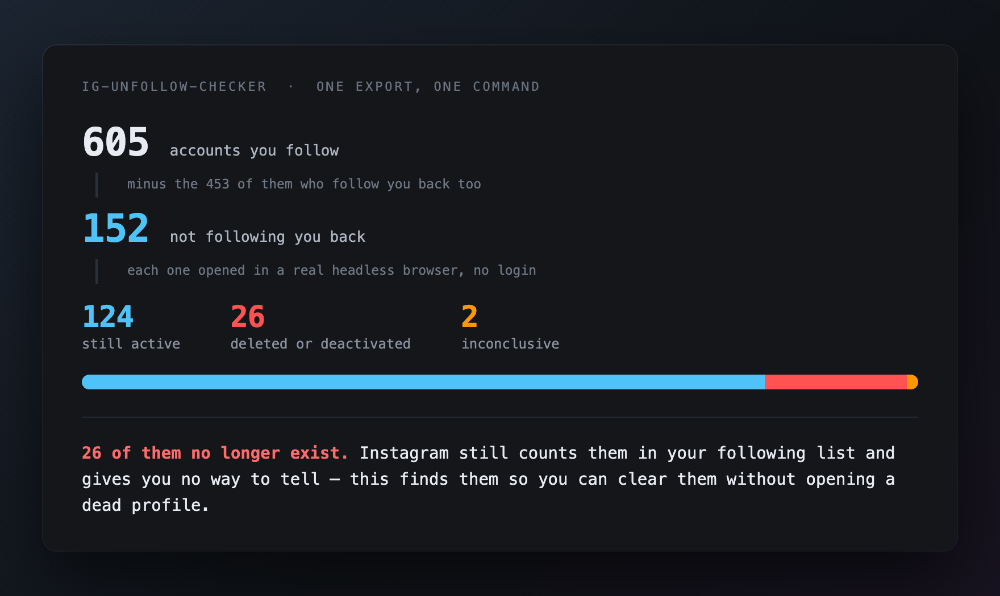
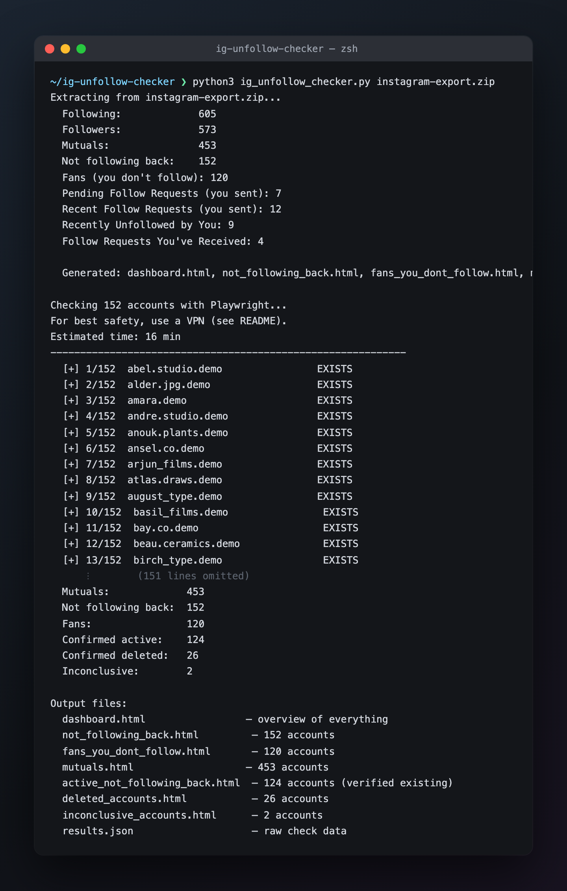
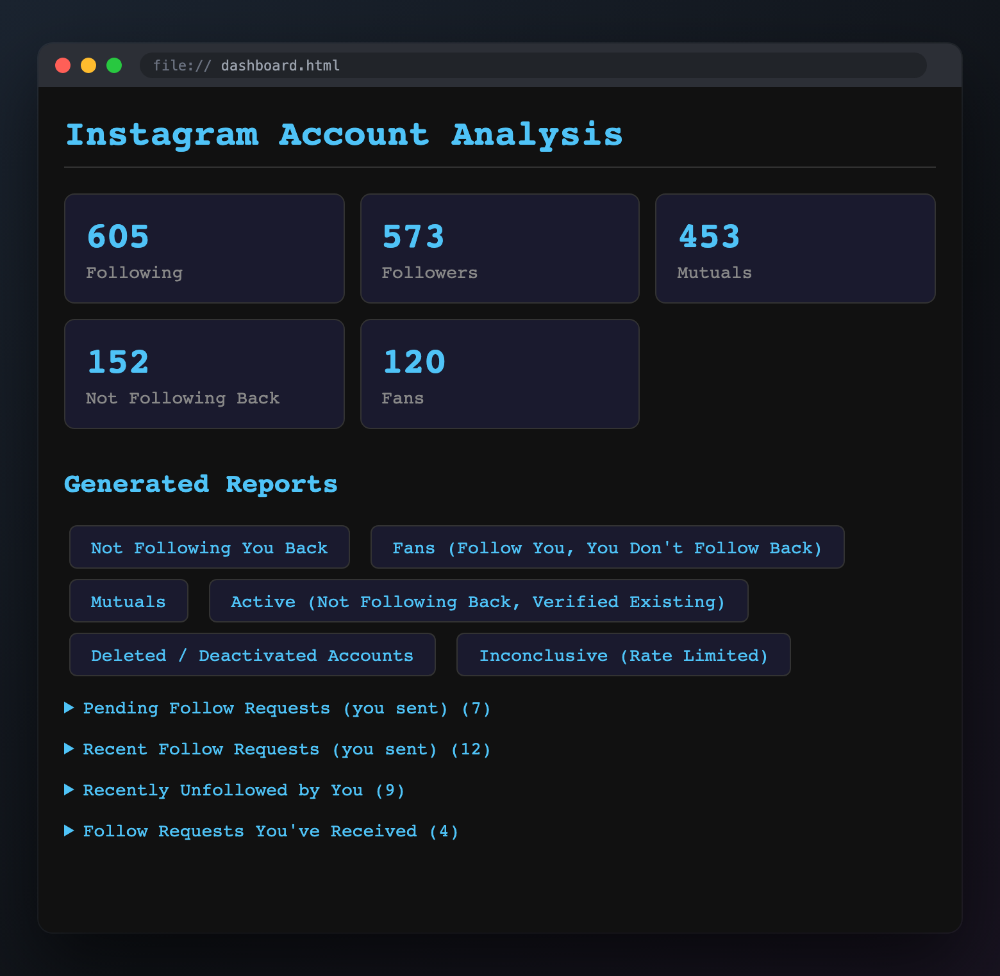
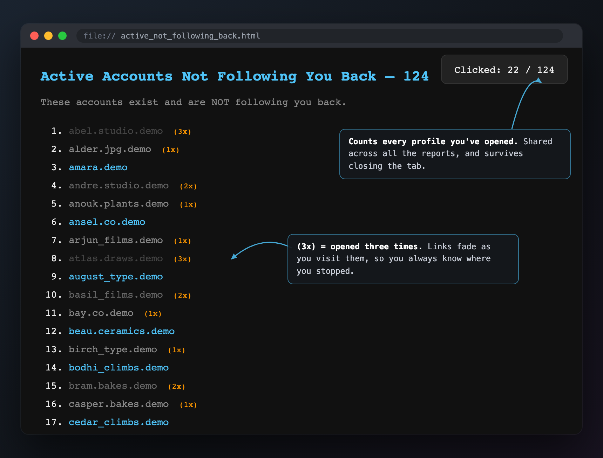
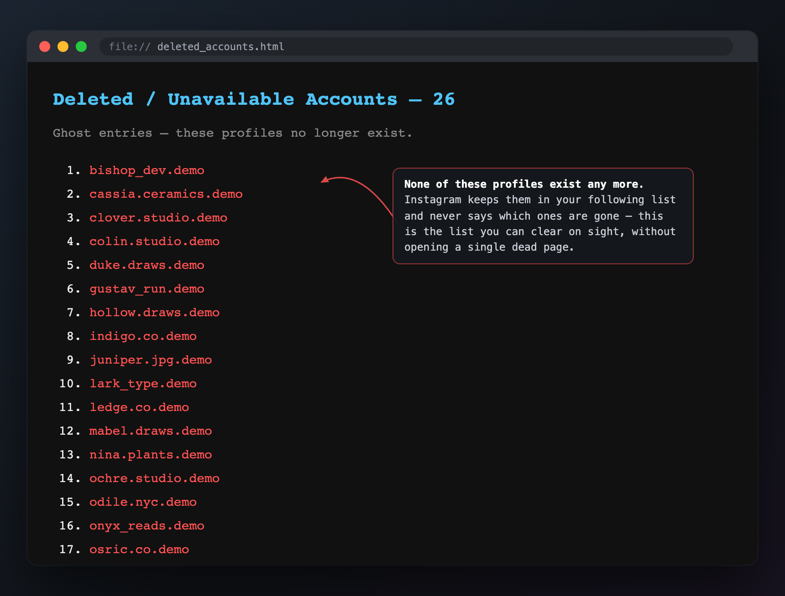

# ig-unfollow-checker

Analyse your Instagram relationships from your own data — who never followed
you back, who left and roughly when, who most likely blocked you, and which
accounts are dead.

**No login. No password. No third-party service.** Your data never leaves your
machine.

Most Instagram follower apps want your login. That is the whole business model,
and it is why several have been caught harvesting credentials. This one reads
the data export Meta is legally obliged to give you, and never asks for a
password — it refuses to run at all if it finds a session cookie.

The thing it does that most do not: **it tells renames apart from unfollows.**
A handle change looks exactly like an unfollow when you diff two exports. On
the account this was built against, 42% of apparent unfollowers had simply
changed their username — every one a false accusation in a tool that does not
check.

## What you get

From your export alone, with no login and nothing installed but Python:

| | |
|---|---|
| **Who doesn't follow you back** | Sorted into confidence tiers, not one flat list — see below |
| **Every follow, timestamped** | When you followed them, when they followed you, going back years |
| **Who left, and roughly when** | Across two or more exports; dated to the window between them |
| **Renames told apart from unfollows** | A handle change looks exactly like an unfollow in a naive diff |
| **Who most likely blocked you** | From Instagram's own log of the follows *you* removed |
| **Dormant and empty accounts** | Zero-post shells and follow-farms, flagged separately |
| **DM history per person** | Message counts, first and last contact, who spoke last, what you left unanswered |
| **One searchable page** | Every account you follow or that follows you, sortable, with a verdict each |

### Why confidence tiers

"Doesn't follow you back" hides three different situations that deserve
different decisions:

- Someone you followed **three days ago** has not snubbed you. They have not
  got round to it.
- Someone whose **handle changed** may have been following you the whole time,
  under a name your older exports do not contain.
- Someone who followed you **for two years and then left** is a real signal.

A flat list treats all three as the same fact. This one does not: each account
is labelled with how much the data actually supports the claim, and
**"cannot verify" is a normal answer**. On the account this was built against,
42% of apparent unfollowers had merely renamed — every one of them a false
accusation in a tool that does not check.

### Who this is for

This is a **command-line tool**. You will need to be comfortable with a
terminal, a Python install, and editing a JSON file with paths in it. If that
sentence sounds unpleasant, one of the drag-and-drop web uploaders will serve
you better — this trades convenience for the fact that nothing ever leaves
your machine.

## No terminal? Use the web version

`web/index.html` does the export analysis in your browser. Drop your ZIP on it
and you get the same reports — no Python, no install, no command line.

**Nothing is uploaded.** There is no server and the page makes no network
requests at all: it has no dependencies, reads the ZIP through the browser's
own decompression, and works with wifi switched off. That is checkable in the
network tab rather than something you have to take on trust.

Drop two or more exports from different dates to unlock the timeline, rename
detection and block detection.

**Just open `web/standalone.html`.** It is one self-contained file — double
click it and it works, no server, no install, offline. Save it anywhere, put it
on a stick, email it to someone.

`web/index.html` is the same app split into modules for development. That one
needs serving (`python3 -m http.server --directory web`), because browsers
refuse to load ES modules over `file://`. Regenerate the single file after
changing any module with `python3 web/build.py`.

## Two tools, and the difference matters

This repository holds two things with very different risk profiles. Keep them
straight before you use or fork it.

### 1. The export analysis — reads your own data

`analysis/` parses the data export Instagram is legally obliged to give you.
It never contacts Instagram's servers, needs no credentials, and everything
stays local. There is no terms-of-service question here: it is your data, and
this is a file parser.

Most of what is interesting lives on this side:

- **Every follow is timestamped.** The export records when you followed each
  account and when each follower followed you, going back years.
- **Follow timeline.** Two or more exports over time show who left and roughly
  when. Instagram logs the follows you remove but never the ones removed from
  you, so a departure is dated to a window between exports, never a moment.
- **Block detection.** Instagram keeps a log of accounts *you* unfollowed. A
  follow that disappeared without a matching entry was removed by someone else
  — which is what a block leaves behind. Cross-referencing the two separates
  "you unfollowed them" from "they blocked you".
- **Username-change detection.** Handles churn constantly, and a rename looks
  exactly like an unfollow in a naive diff. Continuity of a handle in your own
  following list distinguishes them.
- **DM metadata.** Message counts, first and last contact, and who spoke last,
  per person. Metadata only by default — never message bodies.

### 2. The profile checker — visits Instagram

`ig_unfollow_checker.py` opens profile pages in a headless browser, logged out,
to tell a live account from a deleted one and to read public bios and counts.

This is the part that **may violate Instagram's Terms of Use** (see the
disclaimer). It is rate-limited, backs off when throttled, and refuses to run
if it finds a session cookie — but it is still automated access, and that is a
different risk category from parsing a file. Use a VPN. If you only want the
safe half, run `analysis/` and never run this.

## What it looks like



Point it at the export and walk away. Every account is checked one at a time and progress is printed as it goes, so an interrupted run tells you exactly where to resume.



`dashboard.html` is the one to open first — the counts up top, a link to every report, and the extra lists from your export tucked into collapsible sections.



The active list is the one you work through — accounts that really exist and really don't follow you back.



The `(1x)` / `(2x)` markers are click counts: each link records how many times you've opened it and darkens as it goes — blue when untouched, grey after one visit, darker at two and three. Instagram has no bulk unfollow, so you open every profile by hand; the counts are how you pick up where you left off, and anything at `(2x)` or more is usually one whose unfollow didn't take the first time. Counts live in your browser under a single key shared by every report, so a username you already dealt with still shows its count when it turns up in another list. That also means the `Clicked:` badge counts everything you've ever opened, not just the page you're on, so its number can run ahead of that page's total.



The ghost list is the payoff. Instagram counts these accounts in your following list but never tells you they're gone, so the only alternative is opening a few hundred profiles by hand to find out.

<sub>Screenshots come from a real run of the pipeline over a synthetic export — every handle shown is a placeholder, and the active/deleted proportions match an actual 1,066-account run. Regenerate them with <code>python3 docs/make_screenshots.py</code>.</sub>

## Setup

The export analysis needs **nothing installed** beyond Python — it is a file
parser. Playwright is only for the profile checker:

```bash
cp snapshots.example.json snapshots.json   # then edit it

pip install playwright                     # profile checker only
python -m playwright install chromium      # profile checker only
```

`snapshots.json` holds the paths to your own exports. It is gitignored and must
stay that way — it identifies you.

### Download your Instagram data (HTML format)

You need the official data export from Instagram. Here's how:

<details>
<summary><b>On iPhone / Android</b> (click to expand)</summary>

1. Open Instagram and tap your **profile picture** (bottom right)
2. Tap the **hamburger menu** (three lines, top right)
3. Tap **Accounts Center** (under "Meta" at the top)
4. Tap **Your information and permissions**
5. Tap **Download your information**
6. Tap **Download or transfer information**
7. Select your Instagram account, tap **Next**
8. Choose **Some of your information**
9. Scroll down and check only **Followers and following** (under "Connections")
10. Tap **Next**
11. Choose **Download to device**
12. Set format to **HTML** and quality to **Low** (we only need text data)
13. Tap **Create files**
14. Wait for Instagram's email (usually 5-30 minutes, can take up to 48 hours for large accounts)
15. Open the email, tap the link, download the `.zip` file

</details>

<details>
<summary><b>On Desktop / Web Browser</b> (click to expand)</summary>

1. Go to [instagram.com](https://www.instagram.com) and log in
2. Click **More** (bottom left sidebar) → **Your Activity**
3. Click **Download your information**
4. Click **Request a download**
5. Select your Instagram account
6. Choose **Some of your information**
7. Check only **Followers and following**
8. Click **Next**
9. Set format to **HTML**, date range to **All time**
10. Click **Submit request**
11. Wait for the email from Instagram
12. Click the link in the email to download the `.zip` file

</details>

> **Tip:** Only select "Followers and following" — you don't need posts, messages, etc. This makes the export much smaller and faster.

> **Official help page:** [help.instagram.com/181231772500920](https://help.instagram.com/181231772500920)

## Using the export analysis

No network, no login, no account contact.

Run step one first — everything else reads what it writes:

```bash
python3 analysis/follow_timeline.py          # step 1: required
python3 analysis/build_everyone.py           # everyone, sortable and searchable
python3 analysis/build_unfollow_shortlist.py # ranked unfollow candidates
python3 analysis/make_lists.py               # every bucket as plain text
python3 analysis/build_crm_export.py         # flat export keyed by username
python3 analysis/build_dm_index.py           # per-person DM history
```

All of them read `snapshots.json` from the current directory; pass `--config`
to point somewhere else. Step one extracts the follow timestamps and works out
which handles have been renamed; the rest depend on that.

`build_everyone.py` gives one row per person you follow or who follows you,
with follow dates, a verdict and DM history, as a sortable page and a CSV.
`build_dm_index.py` needs the export unzipped as well as the zip, because the
messages live as files rather than in one page.

Everything here runs without the profile checker. If you have run it, bios,
follower counts and ghost tiers appear as extra columns; if you have not, the
same reports are produced without them.

Two exports are enough for a timeline; more is better. Export monthly and keep
the zips — the resolution of every "when did they leave" answer is the gap
between your snapshots.

## Using the profile checker

This part visits Instagram. Read the risk note above first.

### Turn on a VPN first

Using a VPN is **strongly recommended** to protect your IP address. Instagram may rate-limit IPs that make too many requests. A VPN means only the VPN's IP gets throttled, not yours.

**Free VPN options:**

| VPN | Data limit | Link |
|-----|-----------|------|
| **ProtonVPN Free** | Unlimited | [protonvpn.com/free-vpn](https://protonvpn.com/free-vpn) |
| **Windscribe Free** | 10 GB/month | [windscribe.com](https://windscribe.com) |
| **Cloudflare WARP (1.1.1.1)** | Unlimited | [1.1.1.1](https://one.one.one.one) |

ProtonVPN Free is the best option — unlimited data, no-logs policy, and easy to switch servers when rate-limited. Just install the app, connect, and run the script.

> **Note:** Tor does NOT work. Instagram blocks all Tor exit nodes.

### Run it

```bash
python3 ig_unfollow_checker.py your-export.zip --analyze-only   # no network
python3 ig_unfollow_checker.py your-export.zip                  # visits profiles
python3 ig_unfollow_checker.py your-export.zip --resume          # after a stop
python3 ghost_grade.py results.json                              # grade the results
```

Roughly 8 seconds per account. Results save after every check and resume by
username, so an interruption costs nothing. Three consecutive login walls stop
the run; switch VPN server and resume.

## What it will not tell you

- **When someone unfollowed you.** Instagram does not log it. Only the window
  between two of your exports.
- **Whether someone blocked you, for certain.** A block is invisible to a
  logged-out visitor. The log cross-reference gives a strong signal, not proof.
- **Whether someone never followed you.** Only that they are absent from the
  snapshots you have, under the handle they use now.

Claims are reported at the confidence the data supports. "Cannot verify" is a
real answer here, and a common one.

## Privacy

Nothing is uploaded. No credentials are requested or accepted — the checker
aborts if it detects an Instagram session cookie, because public profile data
needs no login and sending a session makes every request attributable to your
account. Generated reports and any file derived from your export are gitignored;
do not commit them.

## Comparing two exports

```bash
python3 ig_unfollow_checker.py --diff old-export.zip new-export.zip
```

This generates:
- **Lost followers** — people who were following you before but aren't now
- **New followers** — people who started following you
- **You unfollowed** — accounts you stopped following
- **You started following** — new accounts you followed
- **Possible blocks** — accounts that were **mutual** (you followed each other) but now they don't follow you anymore. This is the strongest signal of a block, since mutuals rarely just unfollow.

It then optionally checks each "lost follower" with the browser to determine if they deleted their account or are still active (and therefore either unfollowed or blocked you).

> **Tip:** Export your data monthly and keep the zips. Name them by date (Instagram does this automatically). The more snapshots you have, the more useful this feature becomes.

## Output files

Reports go to an `ig-reports/` folder next to the export you point the tool at, and the run prints the path on startup. They list real usernames, so the default deliberately keeps them out of a clone of this repo: run the tool from inside the checkout and the reports go to `~/ig-unfollow-checker-reports/` instead, where a stray `git add -A` can't pick them up. Pass `--output-dir DIR` to put them anywhere you like.

| File | Description |
|------|-------------|
| `dashboard.html` | Summary overview with stats and links to all reports |
| `not_following_back.html` | Accounts you follow that don't follow you (click-tracked) |
| `fans_you_dont_follow.html` | Accounts that follow you but you don't follow back (click-tracked) |
| `mutuals.html` | Accounts you follow each other |
| `active_not_following_back.html` | Verified existing accounts not following you back |
| `deleted_accounts.html` | Confirmed deleted/deactivated ghost accounts |
| `inconclusive_accounts.html` | Couldn't determine status (rate-limited) |
| `results.json` | Raw data for all browser checks |
| `.txt` files | Plain text versions of each list |

Additional HTML files are generated for any pending requests, recent unfollows, or received follow requests found in your export.

## Options

```
--analyze-only          Just analyze the zip (no browser checks, no VPN needed)
--check-list FILE       Check a plain text file of usernames instead of a zip
--diff OLD_ZIP NEW_ZIP  Compare two exports to detect unfollows/blocks
--start-at N            Resume browser checks from position N (after rate limit)
--resume                Continue from results.json, retrying errors and rate-limited entries
--limit N               Check at most N accounts this run (for a trial run)
--output-dir DIR        Save reports to DIR (default: ig-reports/ beside your export)
--show-browser          Show the browser window (for debugging)
```

## Tests

```bash
pip install pytest
pytest tests/                    # unit tests, no network
pytest tests/ --run-smoke        # + tests that hit real Instagram
```

## Disclaimer

**This tool is provided as-is, for personal and educational use only.** By using this software, you acknowledge and agree that:

- **Use at your own risk.** The author(s) are **not responsible** for any account restrictions, rate limiting, shadowbans, temporary blocks, or any other actions taken by Instagram/Meta against your account or IP address as a result of using this tool.
- This tool interacts with Instagram's public-facing web pages in a way that may violate Instagram's [Terms of Use](https://help.instagram.com/581066165581870) or [Community Guidelines](https://help.instagram.com/477434105621119). You are solely responsible for ensuring your use complies with applicable terms and laws.
- **No warranty** is provided, express or implied. The software is provided "as is" without warranty of any kind.
- The author(s) make **no guarantees** about the accuracy of results. Instagram's web interface changes frequently and may break detection at any time.
- **If you want to be extra safe:** always use a VPN (see [free options above](#2-recommended-turn-on-a-vpn)), use `--analyze-only` for zero risk, and keep delays conservative.

## License

**GNU Affero General Public License v3.0 or later** (AGPL-3.0-or-later). See
[LICENSE](LICENSE).

You can use, modify and share this freely. The one obligation that matters: if
you run a modified version **as a network service**, you must offer your users
its source. Ordinary open-source licences do not cover software-as-a-service,
and the tools this competes with are hosted services — this one is licensed so
that improvements to it stay available to the people using it.

Copyright (C) 2026 William Wang.
